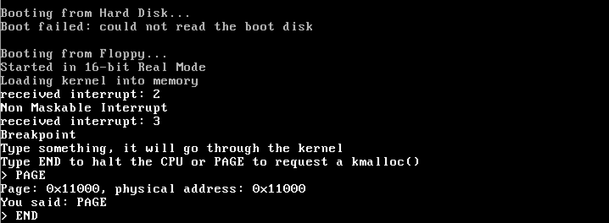

# VoxelOS -- A simple executable OS backbone

This is a simple operating system created from scratch with assembly and C. 

# Requirements:
1. The latest version of the **QEMU Simulator**
2. The latest version of binutil's **i386** components. Installation can be automated by scripts in **/scripts**

# Structure of the source:
1. **./boot**: Assembly programs for the 16-bit real mode section, the 32-bit protected mode section, the GDT table, and the kernel entry. 
2. **./cpu**: The IDT and ISR tables for interrupt registration, type definitions, and I/O. Written in C exclusively. 
3. **./drivers**: Reorganized I/O ports with screen I/O. Written in C exclusively. 
4. **./kernel**: Reorganized kernel functions that registers the IDT and ISR tables and enters the C compiler. Written in assembly and C. 
5. **./libc**: Basic memory allocation and string processing. Written in C exclusively. 
6. **./scripts**: Shell scripts that install i386 dependencies and compile the system. 
7. **test folders**: For debugging purposes. 
8. **Makefile**: Compile the binary, which can be executed with QEMU. 
9. **bootsect.bin**: the 512-byte boot section. Reads additional memory from an arbitrary floppy disk. 

